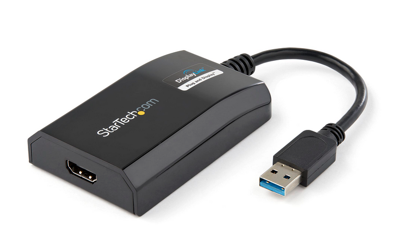

###  2021-09-16

#### Resumen en un pequeño párrafo rápidamente
Pues no he podido desarrollar alguna sección más, porque he estado buscando la forma de poner una segunda pantalla externa al macbook air.

#### Nota
Siglos... siiiiiiiglos, llevaba buscando cómo poner dos pantallas externas al macbook air, porque realmente nada funcionaba bien. 

Pues al final un aparito, algo caro que convierte USB a HDMI y necesita un programita, te permite conectar una segunda pantalla. Pierdo un USB, ok. Por mí vale, pero gano doble de espacio en pantalla, así que 2 pantallas, más la del portátil va a quedar un espacio de trabajo muy bueno.

Si tienes un macbook air de principios del 2015 y estás en esta situación, el aparatito en cuestión que funciona es [este](https://www.startech.com/en-us/audio-video-products/usb32hdpro) ;)

¡Por ahora nada más que añadir!

Es normal que no pueda estar con esto todos los días porque el trabajo diario no me deja.

**PD:** Hoy juega el Betis xD

