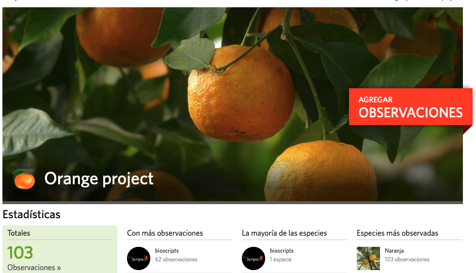

### 2021-09-18

#### Resumen en un pequeño párrafo rápidamente
Hoy he estado contando naranjos. Sí, naranjos para el proyecto [OrangeProject](../Proyectos/BioScripts/OrangeProject.md)

#### Nota
Hace un tiempo, mucho tiempo atrás... yo no sé cuando ya, pero empecé un proyecto en [iNaturalist](https://inaturalist.org) que se llamaba [Orange Project](https://www.inaturalist.org/projects/orange-project) y ahí quedó, empecé a tomar unos puntos sin fotos, y manualmente... no era lo que quería.

Después pasaron muchas cosas en mi vida, y ahora (hace un tiempo atrás) es cuando estoy retomando los proyectos que realmente me gustan como este. Que tú dirás, _y pa qué quieres contar naranjos_ y yo te diría que tienes razón, pero de cosas sin sentido está la vida y esta puede ser una... o no.

Bueno, pues 3 Doritos después.

Estuve dando un poco de vuelta a cómo mejorar esto, y me hice un bot de telegram. Este bot, lo que hace es recibir la imagen que le mande, me pregunta si es un naranjo (por si te equivocas de imagen) y después te pregunta si quieres mandar localización (que normalmente la mando mediante GPS) **¿Por qué Telegram?** Porqué es el que me permite hacer este tipo de bots, básicamente.

El proceso es sencillo.

1. Envías una foto o tomas una foto.
2. El bot identifica que has enviado una foto y te pregunta **Hola ¿nos mandas la foto de un naranjo?** y te da dos opciones **Sí, es un naranjo** o **No, no es un naranjo**
3. Si la respuesta es **No** el sistema termina y borra la imagen enviada.
4. Si la respuesta es **Sí** salta un segundo diálogo **Ahora necesitamos geoposicionar el naranjo. ¿Quieres obtener tu ubicación actual?** . Esto es una Yes/No Questión, si le dices que sí, te pide permiso para obtener tu posición y mandar la latitud y longitud, que luego te muestra en pantalla y te confirma que se ha guardado.

Lo bueno de esto es que se guarda temporalmente en una base de datos para mi posterior tratamiento, porque en un primer paso, soy yo el que está enviando los datos, pero en una fase posterior serán otras personas, y para evitar que me manden fotos de penes, tendré que moderarlas antes de subirlas, y ahora te explico por qué.

El bot, una vez guarda la información correctamente, manda el dato al proyecto de iNaturalist antes mencionado y lo guarda.

Lo que ocurre es que la posición GPS no es perfecta y le intento añadir unos parámetros para luego ajusar estos datos, esta parte es la que quiero mejorar.

¡Y por ahora, esto es todo!