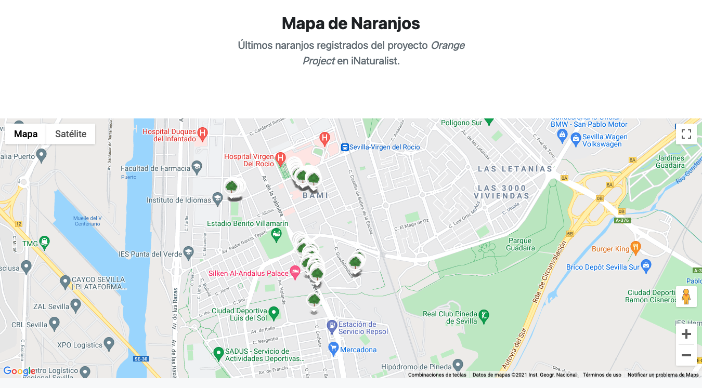

### 2021-09-26
#### Resumen en un pequeño párrafo rápidamente
En mi tiempo libre he seguido 2 años más con la revista Hidden Nature. He estado maquetando el número 16 sobre CienciArte. También he implementado el mapa de naranjos en OrangeProject.

#### Nota
La revista número 16 ha sido un esfuerzo final que ha hecho que me decida completamente a tomarme el proyecot de otra forma.

Sobre el proyecto Orange Project he puesto un mapa de localización.

La web, está aquí: [OrangeProject](https://www.bioscripts.net/OrangeProject/)