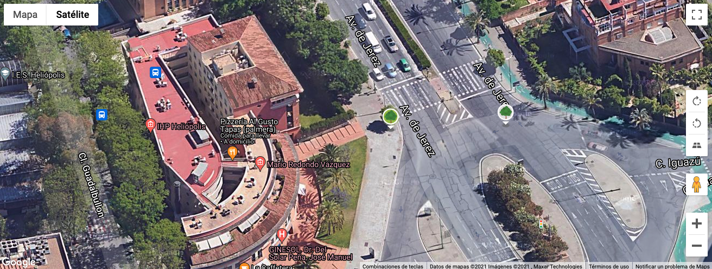
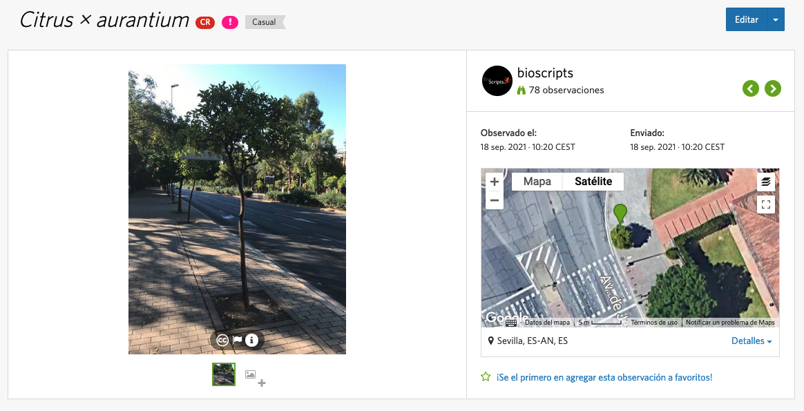

### 2021-10-03

#### Resumen en un pequeño párrafo rápidamente
Lo sencillo se vuelve complicado como una pequeña bola de nieve que al final termina en una gigantesca.
#### Nota
¿Qué quiero decir con esto? Pues que llevo un fin de semana de autotortura para ver la mejor forma de rectificar las posiciones de los naranjos mientras voy tomándolas con el bot de telegram.

Y seguramente me falte resolver un punto en concreto. 

Lo primero es que tengo que incorporar todo lo que respecta al login de iNaturalist. La cuestión es, que tengo que conectar con mi cuenta si quiero rectificar el punto en la observación.

El truco ha sido finalmente añadir un paso más al bot de telegram. Un paso donde te envíe a una url para afinar la posición del naranjo, ya que la posición de telegram, deja mucho que desear (y eso está siempre y cuando veas el naranjo en el mapa satélite, si no, estás jodido amigo).

Esta url carga un mapa con la posición inicial enviada por el bot de telegram (tened en cuenta que estos datos los tengo guardados en una base de datos, por lo que he añadido algunos campos para guardar la id de la observación de inaturalist, la segunda posición gps más afinada y de paso la id del usuario de inaturalist)

El tema es que el hizo el código de iNaturalist para PHP hizo unas funciones básicas que me han servido. Pero por ejemplo la de edición no estaba y he tenido que crearla, por el camino he perdido en un punto la imagen del punto con el que estaba probando, pero creo es porque iNaturalist no pillaba uno de los parámetros para que no me borrara la foto, así que la envío de nuevo por si acaso.

Aquí en la primera foto, el punto con color blanco era el original tomado con el móvil.... y el segundo el deseado, es decir, el segundo punto (verde) lo he marcado manualmente, y al hacerlo se envía la información a iNaturalist para guardar los datos y de paso los guardo yo también en mi base de datos, por eso ahora peudes ver los dos puntos dibujados (porque los tengo y los pinto).

Y finalmente todo queda ajustado en la observación de iNaturalist.

El próximo día toca campo xD, es decir, toca ver los mismo puntos pero usando este nuevo método, por lo que dejo por aquí como fue la primera prueba sin rectificar posiciones.

Y esto es to... to.... to.... toooodoo amigos.
