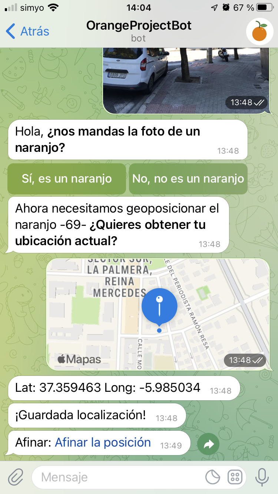

### 2021-10-06

#### Resumen en un pequeño párrafo rápidamente
Prueba de afinado en bot de telegram.

#### Nota
Hoy he realizado una prueba de los cambios para afinar la posición con el bot de telegram.

1. Importante, la sesión de inaturalist se queda aunque cierre la ventana del explorador donde me lleva telegram. ¡Bien!
2. El enlace de afinado ha tardado un poco más de lo normal (no sé por qué, pero ha llegado).
3. El marcar la posición segunda en el mapa ha llevado otro ratito, porque:
	1. No veía el naranjo en la vista de satélite, por lo que he tenido que girar el mapa.
	2. La posición del naranjo estaba a unos 30-40 metros, por lo que tuve que mover la posición del naranjo mejor.

Posibles mejoras o caminos alternativos.
1. Dejar de pillar la info con el gps desde telegram y marcar el naranjo manualmente con la posición actual en la que me encuentre.
2. No guardar los cambios en iNaturalist y guardarlos temporalmente en la base de datos, para luego enviarlos todos de golpe a iNaturalist, y no ralentizar tanto la toma de datos.

Recordemos que la toma de fotos desde el móvil en una app me implica aprender a programar nativo en Android/iOS y no tengo muchas ganas, dado que Cordova no tiene los resultados deseados o nos encontramos con problemas a la hora de usar la cámara o el gps (sobre todo la cámara).

Pensando... 

Otra opción es hacer que el mapa de afinar se muestre sin necesidad de conectar con inaturalist, si no conectas se guarda en local, y si conectas se envía a intaruralist. Aunque si no conectas implica un segundo paso de enviar a inaturalist.

También tengo que ver que ahora mismo es un servidor el que  está enviando los datos, pero la idea es que haya más gente para enviar, por lo que digamos que tengo que:
1. Que el bot de telegram detecte que no es una persona permitida para enviar a iNaturalist y guarde el registro para su revisión (con posición afinada)
2. Que la posición de afinar funcione sin enviar a iNaturalist

Bueno, otro día sigo.